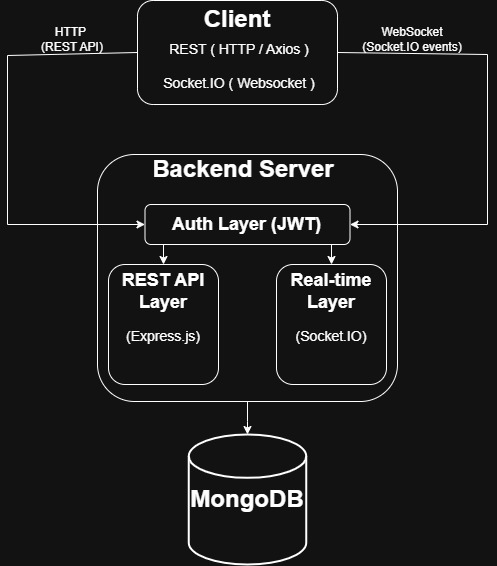

# Real-time Chat Application
A full-stack real-time chat application built with the MERN stack. It includes secure JWT-based authentication and leverages Socket.IO for seamless real-time communication. The application features a clean, responsive user interface designed using Tailwind CSS.

## Introduction

## 🏗️ Architecture

**Architecture Diagram**




This application follows a unified backend architecture where both REST APIs and real-time communication (Socket.IO) are handled by a single Node.js server.

- REST API (Express) handles authentication and data fetching
- Socket.IO manages real-time messaging and events
- MongoDB is used for persistent storage


## 🚀 Features

- **User online/offline status**
- **Message status system (sent, received and seen)**
- **Typing indicator**
- **Pagination of messages (infinite scroll)**
- **Toast for new messages**
- **JWT-based user authentication**
- **Refresh token system**
- **MongoDB TTL for token expiry**
- **Password hashing with bcrypt**
- **Secure API routes**
- **Private chats**
- **Responsive design**


## 🛠️ Tech Stack

**Frontend**
- React
- TailwindCss

**Backend** 
- Nodejs
- Express

**Database** 
- MongoDB

**Real-time Communication**
- Socket.io

## 📦 Installation

1. **Clone the repository**

```bash
git clone https://github.com/Zapitive/realTimeChatApp.git
cd realTimeChatApp
```

2. **Install dependencies**
- **Note** :- Installation of dependencies is required on both frontend and backend.
```bash
# for frontend 
cd client
npm install
```
```bash
# for backend
cd server
npm install
```

3. **Setup environment variables**

Create a ```.env``` file in root directory of server and add:
```bash
PORT = 5000
mongoDB_URI = your_mongoDB_url
JWT_SECRET_KEY = your_secret_key(randomLongString)
FRONTEND_URL = "http://localhost:5173"
```

Create a ```.env``` file in root directory of client and add:
```bash
VITE_API_URL = "http://localhost:5000"
```

4. **Run the application**

- **Note** :- Run the server as well as client.
``` bash
npm run dev
```

## 📁 Project Structure

```
realTimeChatApp/
├── client/              # React Frontend
│   └── src/
│       ├── components/  # Reusable UI components
│       ├── pages/       # Application pages (routes)
│       └── api/         # API request functions
│
├── server/              # Backend (Node.js & Express)
│   ├── controllers/     # Business logic for requests
│   ├── middlewares/     # Request handling (auth, validation, etc.)
│   ├── routes/          # API route definitions
│   ├── models/          # Database schemas/models
│   ├── socket/          # Real-time logic
│   ├── services/        # DB operations
│   ├── utils/           # Helper and utility functions
│   ├── .env             # Environment variables
│   └── package.json     # Backend dependencies
│
└── README.md            # Project Documentation
```

## 👨‍💻 Author

Pranay Karbele

GitHub: [Zapitive](https://github.com/Zapitive)